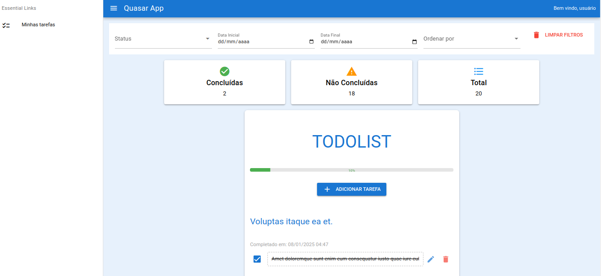

# Para rodar a aplicação, siga o passo a passo

## Esse projeto tem como finalidade criar uma interface agradavél e simples para listar, criar e atualizar uma lista de tarefas, consumindo da API https://github.com/rafPH1998/teste-softpar-api. É de suma importância que sua API esteja rodando para ter sucesso no uso dessa aplicação desse repositório.

## Clone o repositório

```bash
git clone https://github.com/rafPH1998/teste-softpar-frontend.git
```

## Acesse a pasta

```bash
cd teste-softpar-frontend
```

## Instale as dependências

```bash
yarn
# or
npm install
```

### Inicie o aplicativo no modo de desenvolvimento

```bash
quasar dev
```

### Crie o aplicativo para produção

```bash
quasar build
```

### Visualização do layout


